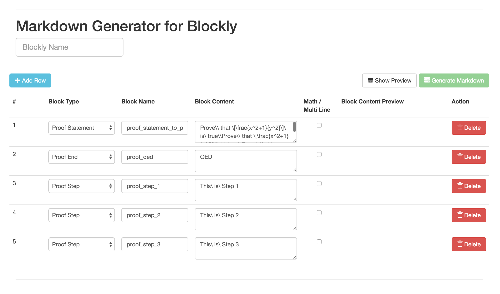

# blockly_proofs
Developing a tool to aid teaching mathematical proofs using **Blockly For Education**

To get started, download the repository into your local machine.
### Components
The process of creating blocks involves 3 parts:

- Generate markdown file for the different blocks
- Feed the markdown into block generator
- Access blockly toolbox

### Generating the Markdown
- Open `markdownGenerator/index.html`

- **Blockly Name** - A name for this blockly component. Accepts only alphabets.
- **Block Type** - There are 3 types of blocks:
	- Proof Statement
	- Proof End
	- Proof Step
- **Block Name** - Name of the block which gets registered in the blockly toolbox.
- **Block Content** - Content of the block. If the content is going to be multi-line or if it contains mathematical expressions, please check the `Math / Multi Line` checkbox.
- **Math / Multi Line** - This checkbox enables the svg image generation. Since blockly is based on SVGs, we are resorting to SVGs to display text in multi-line and with mathematical expressions. Line breaks are equal to `\\` and mathematical expressions are based on `LaTex`.
- **Show Preview** - Click this to get a preview of the SVG if the checkbox is checked.
- **Generate Markdown** - Once the preview of the SVG is generated and if its fine, click on Generate Markdown button.
- **Download Markdown** - Once the markdown is generated, click on the download button which pops up.

### Feeding the Markdown to the blockly generator
- Once the file is downloaded, copy it to the `src` folder of the project.
- Navigate to `src` and run `python generateBlocklyFromInput.py` from the command line.
- If the script runs successfully, you should see this message on the command line
`Process completed successfully. Please check the logfile: ../log/blocklyGenerator.log for more details.`
- If it had errors, you should see this message. In this case, check the log file under the log folder of the project
`-Error encountered during the process. Please check the logfile: ../log/blocklyGenerator.log`
- On successful completion,
	- the downloaded SVGs can be found in folder `<path_of_project>/output/generatedBlocklys/<blockly_name>`
	- the JS can be found in `<path_of_project>/js/blocks/output.js`

- Now you are all set.

### Working with Blockly Toolbox
- Open `<path_of_project>/index.html`

![alt text] (screenshots/blocklyToolbox.png "Blockly Toolbox")

- Click on Proof pane to display the different blocks which have been generated and drag and drop to start building the blocks

### In Progress
- Now that the blocks are in place, they need to be verified based on a rubric.